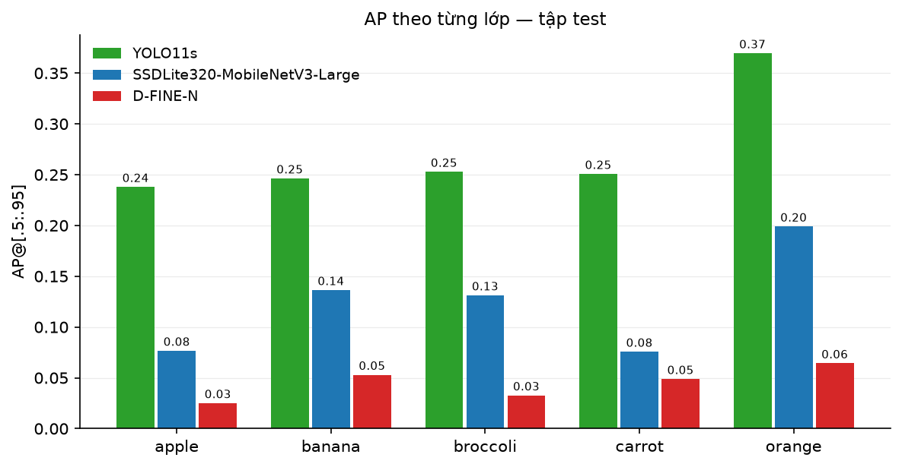
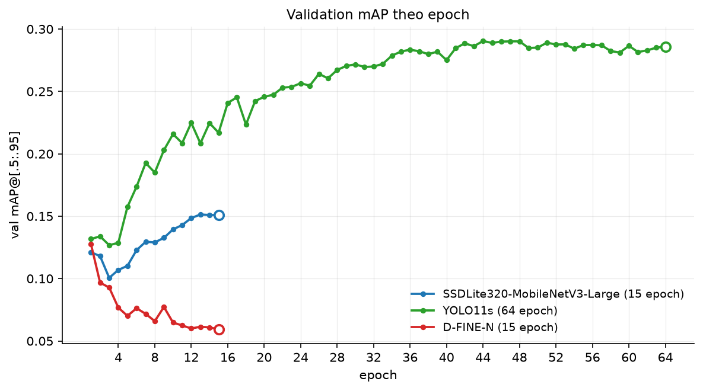
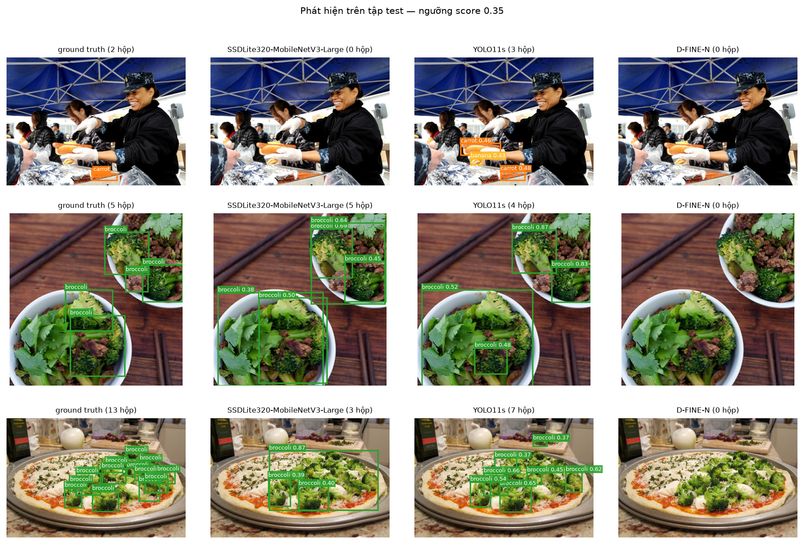

# Ghi nhận kết quả huấn luyện và đánh giá ba mô hình

## 1. Bối cảnh

Ba kiến trúc thuộc ba hướng tiếp cận khác nhau được huấn luyện trên cùng một tập dữ liệu, cùng một phần cứng, rồi chấm điểm bằng cùng một bộ đo.

| Hạng mục | Nội dung |
|---|---|
| Dữ liệu | Tập con COCO 2017, 5 lớp `apple / banana / broccoli / carrot / orange` |
| Phân chia | train 5.803 ảnh · val 1.024 ảnh · **test 310 ảnh** |
| Nguồn tập test | Trích từ COCO `val2017`, không tham gia huấn luyện lẫn chọn checkpoint |
| Phần cứng | NVIDIA RTX 4060 Laptop 8 GB, PyTorch 2.13.0+cu126, Python 3.11.15 |
| Bộ đo | `pycocotools` COCOeval, áp dụng như nhau cho cả ba mô hình |
| Trọng số được chấm | Checkpoint cuối của mỗi lượt huấn luyện |

Cả 5 lớp đang xét đều nằm trong 80 lớp của COCO. Vì vậy mỗi mô hình được khởi tạo bằng cách sao chép trọng số của 5 lớp tương ứng từ checkpoint COCO gốc thay vì khởi tạo ngẫu nhiên, và điểm số tại thời điểm chưa huấn luyện không bằng 0.

Điều này cho phép thêm một mốc chuẩn: điểm của chính checkpoint COCO khi chưa huấn luyện lại. Mốc này trả lời câu hỏi mà một bảng kết quả đơn thuần không trả lời được — quá trình huấn luyện đóng góp thêm bao nhiêu so với việc dùng thẳng checkpoint công khai.

---

## 2. Cấu hình và chi phí huấn luyện

| | SSDLite320-MobileNetV3 | YOLO11s | D-FINE-N |
|---|---|---|---|
| Hướng tiếp cận | CNN một giai đoạn, dựa trên anchor | YOLO một giai đoạn, không anchor | Transformer (họ DETR), đầu-cuối |
| Thư viện | torchvision | ultralytics 8.4.117 | transformers 5.15.0 |
| Tham số | 2.261.960 | 9.414.735 | 3.722.121 |
| Kích thước ảnh vào | 320×320 | 640×640 | 640×640 |
| Dung lượng checkpoint | 8,9 MB | 18,3 MB | 14,5 MB |

| Tham số huấn luyện | SSDLite | YOLO11s | D-FINE-N |
|---|---|---|---|
| Epoch cấu hình | 15 | 80 | 15 |
| Epoch chạy thực tế | 15 | **64** (dừng sớm) | 15 |
| Batch size | 32 | 16 | 16 |
| Bước / epoch | 181 | 363 | 362 |
| Optimizer | SGD, momentum 0.9, nesterov | AdamW (`optimizer=auto` tự chọn) | AdamW |
| Learning rate | 0.01 | 0.01 → 0.0011 (tự điều chỉnh) | 2.5e-4 (backbone 2.5e-5) |
| Weight decay | 4e-5 | 5e-4 | 1e-4 |
| Warmup | 3 epoch | 3 epoch | 2 epoch |
| Lịch learning rate | cosine | cosine | cosine |
| Cắt gradient | 10.0 | — | 0.1 |
| EMA | 0.999 | nội bộ ultralytics | 0.999 |
| AMP | có | có | có |
| Tăng cường dữ liệu | photometric, zoom-out, IoU-crop, lật | mosaic, HSV, scale, lật | lật, photometric nhẹ |
| Dừng sớm | — | `patience=20` | — |

| Chi phí thực tế | SSDLite | YOLO11s | D-FINE-N |
|---|---|---|---|
| Tổng thời gian | 29,7 phút | 89,7 phút | 42,2 phút |
| Thời gian trung vị mỗi epoch | 96,5 s | 83,5 s | 140,2 s |
| Epoch có val mAP cao nhất | 13 | 44 | 1 |
| VRAM đỉnh | 1,81 GB | 4,24 GB | 3,09 GB |

Cả ba dùng `workers=2`. Trên Windows, tiến trình nạp dữ liệu được sinh bằng `spawn` chứ không `fork`, nên mỗi worker phải nạp lại toàn bộ thư viện; con số 2 là mức đo được ổn định trên máy này.

YOLO11s được cấu hình 80 epoch nhưng dừng ở epoch 64. Cơ chế `patience=20` của ultralytics dừng huấn luyện khi val mAP không cải thiện trong 20 epoch liên tiếp; đỉnh rơi vào epoch 44 nên điều kiện này được kích hoạt ở epoch 64.

---

## 3. Kết quả trên tập test

### 3.1 So với checkpoint chưa huấn luyện

| Mô hình | Checkpoint gốc | Sau huấn luyện | Chênh lệch |
|---|---|---|---|
| SSDLite320-MobileNetV3 | 0,1057 | **0,1237** | +0,0180 |
| YOLO11s | **0,2814** | 0,2714 | −0,0100 |
| D-FINE-N | **0,2715** | 0,0447 | −0,2268 |

(mAP@[.5:.95] trên tập test 310 ảnh)

### 3.2 Chỉ số đầy đủ sau huấn luyện

| Mô hình | mAP@[.5:.95] | mAP@.5 | mAP@.75 | AR@100 | ms/ảnh | FPS |
|---|---|---|---|---|---|---|
| SSDLite320-MobileNetV3 | 0,1237 | 0,2303 | 0,1178 | 0,2721 | 12,4 | 80,7 |
| YOLO11s | 0,2714 | 0,4103 | 0,2865 | 0,5552 | 6,6 | 150,8 |
| D-FINE-N | 0,0447 | 0,0903 | 0,0391 | 0,4527 | 21,4 | 46,8 |

Độ trễ đo ở batch = 1 trên GPU, bỏ qua các vòng khởi động và có đồng bộ CUDA, tức là chi phí của một lượt suy luận đơn lẻ. Cần lưu ý: GPU trên máy laptop tự hạ xung nhịp khi rảnh (2370 MHz so với mức tối đa 3105 MHz), nên giá trị tuyệt đối thay đổi tới hai lần giữa các lần đo. Ba số trên được đo trong cùng một lượt khi GPU đang ở xung cao, nên so sánh được với nhau; thứ tự giữa ba mô hình giữ nguyên ở mọi lần đo.

### 3.3 AP theo kích thước vật thể

| Mô hình | nhỏ | trung bình | lớn |
|---|---|---|---|
| SSDLite320-MobileNetV3 | 0,0014 | 0,0801 | 0,3210 |
| YOLO11s | 0,0811 | 0,3089 | 0,4100 |
| D-FINE-N | 0,0135 | 0,0850 | 0,0715 |

### 3.4 AP theo từng lớp



---

## 4. Nhận xét

### 4.1 Diễn biến trong quá trình huấn luyện



Cả ba đường cong đều đi xuống trong ba epoch đầu. Đây là hệ quả của giai đoạn warmup: learning rate tăng tuyến tính từ gần 0 lên mức đỉnh, và trong lúc đó phần đầu phân loại vừa được sao chép từ COCO bị đẩy ra khỏi vị trí ban đầu nhanh hơn tốc độ nó học lại. Điểm thấp nhất của SSDLite và YOLO11s rơi đúng vào epoch 3, thời điểm learning rate chạm đỉnh.

Từ epoch 4 trở đi, khi cosine bắt đầu hạ learning rate, hai đường này đi lên. SSDLite phẳng dần ở epoch 13–15 (0,1514 rồi 0,1509), cho thấy nó đã tiến gần điểm bão hoà với cấu hình hiện tại.

YOLO11s tăng đều đến khoảng epoch 44 rồi dao động trong khoảng 0,284–0,290 suốt 20 epoch sau đó mà không lập đỉnh mới. Với 5.803 ảnh huấn luyện, mô hình chạm giới hạn của lượng dữ liệu chứ không phải giới hạn của số epoch. Một lượt huấn luyện ngắn hơn nhiều, 15 epoch, đạt 0,2883 trên tập val — chênh 0,002 so với đỉnh 0,2904 của lượt 64 epoch, trong khi chi phí chỉ bằng một phần tư.

D-FINE-N đi theo hướng ngược lại: đạt 0,1277 ngay tại epoch 1 rồi giảm đều đến 0,0593 ở epoch 15. Learning rate của nó đã hoàn tất warmup từ epoch 2 và giảm xuống 2,5e-06 ở epoch cuối, nhưng đường cong không hồi lại. Trong khi đó hàm mất mát vẫn giảm đơn điệu suốt quá trình (17,29 xuống 14,74). Hai dấu hiệu này cùng tồn tại có nghĩa: quá trình tối ưu vẫn vận hành đúng về mặt cơ học, nhưng đại lượng đang được tối thiểu hoá không đi cùng chiều với chất lượng phát hiện đo bằng COCO mAP.

### 4.2 Đóng góp của việc huấn luyện lại

Bảng ở mục 3.1 cho thấy ba kết quả khác nhau, và lý do nằm ở điểm xuất phát của từng mô hình.

SSDLite là mô hình duy nhất tăng điểm. Nó cũng là mô hình có mốc xuất phát thấp nhất (0,1057), nên còn nhiều dư địa để chuyên biệt hoá vào 5 lớp. Việc thu hẹp từ 80 lớp xuống 5 lớp giúp mô hình không phải phân biệt táo với 75 loại vật thể khác.

YOLO11s giảm nhẹ 0,0100. Nó xuất phát từ 0,2814, mức đã khá cao. Cần lưu ý về nguồn dữ liệu: tập huấn luyện 5.803 ảnh của dự án là một tập con của COCO train2017, tức là chính dữ liệu mà checkpoint gốc đã được huấn luyện trên đó cùng với hơn 112.000 ảnh khác. Việc huấn luyện lại ở đây không bổ sung dữ liệu mới, mà thu hẹp phạm vi mô hình về một phần nhỏ của những gì nó đã học.

D-FINE-N giảm 0,2268, tương đương còn một phần sáu điểm ban đầu. Mốc chuẩn 0,2715 của nó cho thấy phần khởi tạo hoạt động đúng: kiến trúc này phát hiện được 5 lớp ở mức tương đương YOLO11s (0,2814) với 3,72 triệu tham số so với 9,41 triệu. Phần suy giảm đến từ quá trình huấn luyện.

### 4.3 Val mAP và test mAP không nói cùng một điều

Hai lượt huấn luyện YOLO11s cho thấy điều này rõ nhất:

| | val mAP@[.5:.95] | test mAP@[.5:.95] | Thời gian |
|---|---|---|---|
| 15 epoch | 0,2883 | 0,2569 | 24,5 phút |
| 64 epoch | 0,2904 | 0,2714 | 89,7 phút |
| Chênh lệch | **+0,0021** | **+0,0145** | |

Nếu chỉ nhìn val, phần huấn luyện thêm gần như không mang lại gì: 0,0021 sau 49 epoch. Trên test thì mức cải thiện là 0,0145, gấp bảy lần.

Nguyên nhân nằm ở cách chia dữ liệu. Tập train và val đều được cắt ra từ COCO train2017, còn tập test lấy từ COCO val2017 — một đợt thu thập khác. Val vì vậy không độc lập với train về phân phối: nó đo mức khớp với dữ liệu huấn luyện nhiều hơn là đo khả năng khái quát. Trong 20 epoch cuối, val mAP đứng yên trong khoảng 0,284–0,290 nhưng mô hình vẫn tiếp tục thay đổi theo hướng khái quát hơn, và phần thay đổi đó chỉ hiện ra trên tập test.

Điều này kéo theo một hệ quả về cơ chế dừng sớm. `patience=20` của ultralytics đếm theo val mAP, và nó đã dừng lượt huấn luyện ở epoch 64 vì đỉnh val rơi vào epoch 44. Nhưng số liệu test cho thấy phần huấn luyện sau epoch 44 vẫn có tác dụng. Với cách chia dữ liệu hiện tại, cơ chế dừng sớm đang dùng một thước đo không phản ánh đúng thứ cần tối ưu.

Khoảng cách val trừ test ở cả ba mô hình đều nằm trong khoảng 0,02–0,03, nên đây là đặc điểm chung của bộ dữ liệu chứ không riêng YOLO11s. Vì lý do đó, mọi con số kết luận trong báo cáo này đều lấy từ tập test.

### 4.4 Khoảng cách giữa khả năng tìm và khả năng chấm điểm

Đặt cạnh nhau tỉ lệ AR@100 (khả năng tìm ra vật thể) và mAP (có tính đến độ tin cậy và độ khớp của hộp):

| Mô hình | AR@100 | mAP@[.5:.95] | Tỉ lệ AR/mAP |
|---|---|---|---|
| SSDLite320-MobileNetV3 | 0,2721 | 0,1237 | 2,2× |
| YOLO11s | 0,5552 | 0,2714 | 2,0× |
| D-FINE-N | 0,4527 | 0,0447 | **10,1×** |

SSDLite và YOLO11s có tỉ lệ khoảng 2×, là mức thông thường. D-FINE-N thì khác hẳn: nó tìm ra vật thể ở mức khá — AR 0,4527, cao hơn SSDLite — nhưng mAP thấp gấp mười lần AR.

Chênh lệch này chỉ ra vị trí của vấn đề. Nếu mô hình không định vị được vật thể thì AR phải thấp; AR 0,45 cho thấy các truy vấn của nó vẫn phủ đúng vùng có vật thể. Thứ suy giảm là điểm tin cậy và độ chính xác của hộp: mAP@.75 (0,0391) chỉ bằng 43% mAP@.5 (0,0903), nghĩa là hộp có phủ đúng vật thể nhưng lệch nhiều khi yêu cầu độ khớp chặt hơn.

Một con số cụ thể hoá điều này: điểm tin cậy cao nhất mà D-FINE-N đưa ra trên toàn bộ 310 ảnh test là 0,334. Toàn bộ dự đoán của nó nằm dưới ngưỡng 0,35 mà ứng dụng web dự kiến dùng để hiển thị. Để so sánh, SSDLite có 499 hộp và YOLO11s có 915 hộp vượt ngưỡng này.

Trong quá trình tìm nguyên nhân, các khả năng sau đã được kiểm tra và loại trừ: việc sao chép trọng số từ COCO (mốc chuẩn 0,2715 chứng minh nó đúng), định dạng nhãn đưa vào hàm mất mát (`class_labels` nằm trong khoảng 0–4, hộp ở dạng cxcywh chuẩn hoá trong [0,1]), chuẩn hoá ảnh đầu vào, và toàn bộ đường ống suy luận cùng ánh xạ lớp (cùng đường ống đó cho 0,2715 khi chưa huấn luyện). Nguyên nhân nằm trong quá trình tối ưu và chưa được xác định.

### 4.5 Ảnh hưởng của kích thước ảnh đầu vào

AP trên vật thể nhỏ của SSDLite là 0,0014, gần như bằng không, trong khi AP trên vật thể lớn của nó đạt 0,3210, tức cùng bậc với YOLO11s (0,4100).

Nguyên nhân nằm ở kích thước đầu vào cố định 320×320 của kiến trúc này. Một quả táo chiếm 32×32 pixel trong ảnh gốc 640×480 sẽ còn khoảng 16×16 pixel sau khi thu nhỏ, và sau sáu tầng giảm mẫu của MobileNetV3 thì nó không còn đủ tín hiệu ở bất kỳ tầng đặc trưng nào để anchor bắt được. YOLO11s và D-FINE-N nhận ảnh 640×640, gấp bốn lần diện tích, nên giữ lại được các vật thể ở dải kích thước này.

Đây cũng là lời giải thích cho phần lớn khoảng cách mAP tổng thể giữa SSDLite và YOLO11s: trên vật thể lớn hai bên khá gần nhau, chênh lệch tập trung ở dải nhỏ và trung bình. Theo thống kê ở notebook EDA, 26,4% instance trong tập huấn luyện thuộc nhóm nhỏ theo chuẩn COCO.

### 4.6 Phân bố theo lớp

Với SSDLite, `orange` (0,1989) cao hơn `apple` (0,0766) và `carrot` (0,0756) khoảng 2,6 lần. Cam trong tập dữ liệu này thường xuất hiện dưới dạng vật thể tròn, đơn lẻ, tương phản cao với nền; táo thường nằm thành đống trong sọt với ranh giới giữa các quả rất mờ, và cà rốt thường bị che khuất một phần hoặc nằm bó chồng lên nhau — cả hai đều là tình huống mà anchor cố định khó tách từng thể hiện riêng.

YOLO11s trải đều hơn: khoảng cách giữa lớp cao nhất (`orange` 0,3695) và thấp nhất (`banana` 0,2463) là 1,5 lần. Cơ chế gán nhãn theo độ khớp nhiệm vụ và tăng cường mosaic khiến mô hình gặp nhiều cấu hình chồng lấn khác nhau hơn trong lúc huấn luyện.

D-FINE-N thấp đều ở cả năm lớp (0,0250–0,0642), không có lớp nào nổi bật. Việc suy giảm xảy ra đồng đều chứ không tập trung vào một lớp cụ thể cho thấy nó không phải hiện tượng gắn với đặc điểm hình ảnh của một loại rau củ nào.

### 4.7 Quan sát định tính



Ba ảnh được chọn theo phân vị mật độ hộp (thưa – trung bình – dày) thay vì lấy các ảnh dày nhất, vì những ảnh dày nhất trong tập test là quầy chợ 25 hộp và ảnh ghép lưới mà không mô hình nào xử lý được, chúng nói về tập dữ liệu nhiều hơn nói về mô hình. Ngưỡng hiển thị là 0,35.

Ở hàng giữa (5 hộp thật), SSDLite và YOLO11s cùng đưa ra 5 hộp bao phủ các cụm bông cải. Ở hàng dưới (13 hộp thật, bông cải rải trên mặt bánh pizza), cả hai đều gom nhiều bông cải nhỏ liền kề thành một hộp lớn thay vì tách riêng. Đây là biểu hiện thị giác của cùng hiện tượng mà cột AP vật thể nhỏ ở mục 4.5 đã đo được bằng số.

Các ô của D-FINE-N trống ở cả ba hàng. Đây không phải do mô hình không sinh ra dự đoán — nó vẫn xuất đủ 100 hộp mỗi ảnh — mà do toàn bộ điểm tin cậy đều dưới 0,35 như đã nêu ở mục 4.4.

### 4.8 Tốc độ suy luận

Thứ tự độ trễ (YOLO11s 6,6 ms < SSDLite 12,4 ms < D-FINE-N 21,4 ms) không đi cùng thứ tự số tham số (SSDLite 2,26 M < D-FINE-N 3,72 M < YOLO11s 9,41 M). YOLO11s có số tham số gấp bốn lần SSDLite nhưng chạy nhanh gần gấp đôi.

Lý do là số tham số không quyết định độ trễ trên GPU; số lần phóng nhân (kernel launch) và mức độ song song mới quyết định. YOLO11s được hợp nhất lớp và gồm các khối tích chập lớn, chạy hết công suất trên GPU trong ít lần gọi. SSDLite dùng tích chập tách theo chiều sâu — tiết kiệm tham số nhưng chia phép tính thành nhiều nhân nhỏ, mỗi nhân không lấp đầy GPU; trên Windows với trình điều khiển WDDM thì chi phí mỗi lần phóng nhân lại càng đáng kể. D-FINE-N thêm phần tự chú ý trên 300 truy vấn và sáu tầng decoder tuần tự, mỗi tầng phải chờ tầng trước.

Cả ba đều nằm trong ngưỡng dùng được cho ứng dụng web nhận một ảnh mỗi lượt: chậm nhất là 21 ms, tương đương 47 ảnh mỗi giây.

---

## 5. Ghi chú về giới hạn của đợt đo này

- **Tập test có 310 ảnh.** Đây là cỡ mẫu nhỏ; chênh lệch nhỏ giữa hai lần đo trên tập này không mang nhiều ý nghĩa thống kê.
- **Tập val không độc lập với tập train về phân phối** (xem mục 4.3). Mọi con số kết luận đều lấy từ tập test vì lý do này.
- **Checkpoint COCO gốc có một chút lợi thế.** Ultralytics và các tác giả D-FINE huấn luyện trên COCO train2017 và kiểm định trên COCO val2017, tức là nguồn của tập test ở đây. Họ không huấn luyện trên đó, nhưng có tinh chỉnh siêu tham số dựa trên nó. Mức thiên vị này khó định lượng.
- **Số của D-FINE-N phản ánh trạng thái cuối của một quá trình huấn luyện đi xuống**, không phản ánh năng lực của kiến trúc D-FINE nói chung. Mốc chuẩn ở mục 3.1 là con số đại diện hơn cho kiến trúc này.
- **Các tham số huấn luyện được lấy nguyên từ registry trong `src/config.py`** và chưa qua tinh chỉnh riêng cho tập dữ liệu 5 lớp này.

## 6. Cách tái lập

```bash
python scripts/10_train.py --model all --epochs 15
```

```bash
python scripts/20_evaluate.py --model all --split test --checkpoint last
```

```bash
python scripts/20_evaluate.py --model all --split test --checkpoint pretrained
```

Kết quả thô: `reports/results/evaluation_test_last.json` và `evaluation_test_pretrained.json`, hình trong `reports/figures/`. Các file dự đoán chi tiết `detections_<model>_test_<checkpoint>.json` được sinh cùng lúc nhưng không lưu trong git vì dung lượng lớn.
